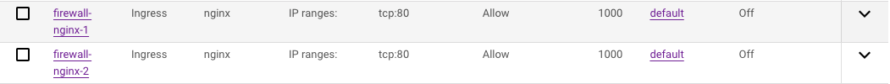
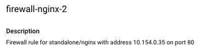
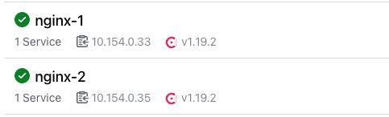

# consul-tf-sync-gcp
An demo of Consul and Terraform sync on GCP. Most of the configuratin is taken form this [guide](https://developer.hashicorp.com/consul/tutorials/network-automation/consul-terraform-sync)

## Prerequisites

Before you begin, ensure you have the following tools installed:

- [Google Cloud CLI (gcloud)](https://cloud.google.com/sdk/docs/install)
- [HashiCorp Packer](https://developer.hashicorp.com/packer/tutorials/docker-get-started/get-started-install-cli)
- **Consul License File**

Absolutely, here’s an updated README section that describes the functionality and setup of the `cts-firewall-module` using the refined Terraform configuration.

---

# CTS Tasks

## cts-firewall-module

This module creates Google Cloud Platform (GCP) firewall rules for services discovered by Consul Terraform Sync (CTS). Specifically, it targets services with the name `standalone/nginx`, as defined in [cts-firewall.hcl](./packer/configs/cts-firewall.hcl). Each firewall rule is dynamically generated using the service’s IP address and tags retrieved from Consul, opening port 80 for any instances with matching tags. 

### How It Works

1. **Service Filtering**: The module filters services to include only those with the name `standalone/nginx`. This ensures that only specific services are processed, keeping firewall rules tightly controlled and relevant.

2. **Firewall Rule Creation**: For each qualifying service:
   - A GCP firewall rule is created with the name `firewall-<service-node>`.
   - Port 80 is opened, allowing HTTP traffic to instances with the Consul tags associated with that service.
   - The rule’s source IP is restricted to the specific IP address of each `nginx` service instance, further narrowing access.
   
3. **Automatic Scaling**: As `nginx` service instances are scaled up or down, CTS detects these changes, creating or removing firewall rules accordingly. This dynamic approach simplifies security management, allowing the firewall rules to adjust automatically based on real-time service discovery.

With 2 nginx nodes this is the created firewall's




This screenshot shows Consul while this was running



### Use Case & Example

This configuration showcases how CTS, combined with Terraform, can automate infrastructure updates based on real-time service changes. By defining rules based on service tags and IP addresses, you can scale firewall access as instances are added or removed, without manual intervention.

### Future Considerations

For larger setups or different use cases, firewall rules could be applied more broadly using tag-based targeting across multiple service types. This would allow more generalized rules (e.g., target groups for specific types of applications) without needing individual IP-based rules, balancing security and scalability.

---

# Configure

## Step 1: Authenticate with GCP

Authenticate your GCP account and configure the project you want to use:

```bash
# Authenticate your GCP account
gcloud auth login
gcloud auth application-default login

# Set your Google Cloud project ID
gcloud config set project <PROJECT_ID>
```

Replace `<PROJECT_ID>` with your GCP project ID.

## Step 2: Set Up License Files

Copy your **Consul** license files (`consul.hclic`) to the root of your working directory:

```bash
cp ~/Downloads/consul.hclic .
```

Ensure both license files are present before building your images.

## Step 3: Build Disk Images with Packer
### Set Packer Variables

Use the provided script to configure necessary variables for the Packer build:

```bash
sh packer/set-vars.sh
```

The script will prompt you for your GCP project ID, region, and other details. By default, it uses **London (europe-west2)** as the region. Modify this if needed during execution.

### Build the Images

Once variables are set, you can use **Packer** to build the **Consul** server and client images. To update the version of **Consul**, modify the `CONSUL_VERSION` in the [provision-consul.sh](./packer/scripts/provision-consul.sh) script.

You can run both builds simultaneously using `./build-packer.sh`, or manually with the following commands:

```bash
# Initialize Packer
packer init packer/gcp-almalinux-consul-server.pkr.hcl
packer init packer/gcp-almalinux-nginx.pkr.hcl
packer init packer/gcp-almalinux-cts.pkr.hcl

# Build the Consul server image
packer build -var-file=variables.pkrvars.hcl packer/gcp-almalinux-consul-server.pkr.hcl

# Build the CTS server image
packer build -var-file=variables.pkrvars.hcl packer/gcp-almalinux-cts.pkr.hcl

# Build the nginx server image
packer build -var-file=variables.pkrvars.hcl packer/gcp-almalinux-nginx.pkr.hcl
```

## Step 4: Provision with Terraform

You can now use Terraform to provision a **Consul** cluster. This example creates a 3-node consul server cluster. The `terraform.tfvars` file is generated from the original `variables.pkrvars.hcl` used during the Packer build.

```bash
# Create tfvars from pkrvars and provision the cluster
sed '/image_family.*/d' variables.pkrvars.hcl > tf/terraform.tfvars
cd tf
terraform init
terraform apply
```
