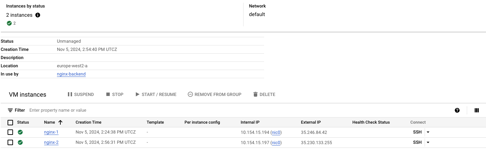
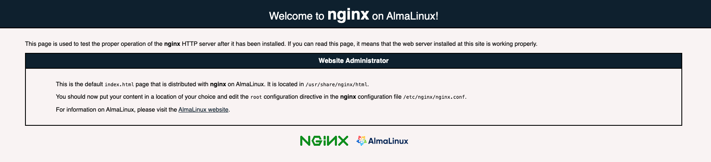
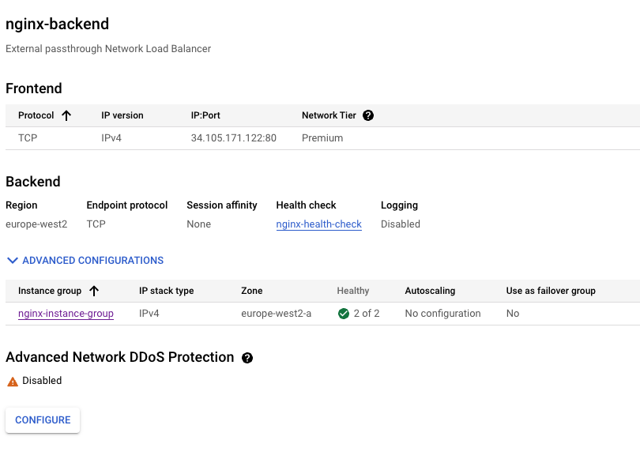

# consul-tf-sync-gcp
A demo of Consul and Terraform Sync on Google Cloud Platform (GCP). Most of the configuration is based on this [guide](https://developer.hashicorp.com/consul/tutorials/network-automation/consul-terraform-sync). More detailed documentation can be found [here](https://developer.hashicorp.com/consul/docs/nia).

**Note:** In this demo, we are using a standalone Consul-Terraform-Sync (CTS) setup. For production, it is recommended to run [Consul-Terraform-Sync with high availability](https://developer.hashicorp.com/consul/docs/nia/usage/run-ha).

## Prerequisites

Before you begin, ensure the following tools are installed:

- [Google Cloud CLI (gcloud)](https://cloud.google.com/sdk/docs/install)
- [HashiCorp Packer](https://developer.hashicorp.com/packer/tutorials/docker-get-started/get-started-install-cli)
- **Consul License File** – More details on Consul-Terraform-Sync Enterprise can be found [here](https://developer.hashicorp.com/consul/docs/nia/enterprise).

---

# CTS Tasks

## cts-firewall-module

This module creates Google Cloud Platform (GCP) firewall rules for services discovered by Consul Terraform Sync (CTS). It specifically targets services with the name `standalone/nginx`, as defined in [cts-firewall.hcl](./packer/configs/cts-firewall.hcl). Each firewall rule is dynamically generated using the service’s IP address and tags retrieved from Consul, opening port 80 for instances with matching tags.

### How It Works

1. **Service Filtering**: The module filters services to include only those named `standalone/nginx`, ensuring that only specific services are processed to keep firewall rules tightly controlled and relevant.

2. **Firewall Rule Creation**: For each qualifying service:
   - A GCP firewall rule is created with the name `firewall-<service-node>`.
   - Port 80 is opened, allowing HTTP traffic to instances tagged with the specified Consul tags.
   - The rule’s source IP is restricted to the specific IP address of each `nginx` service instance, further narrowing access.

3. **Automatic Scaling**: As `nginx` service instances scale up or down, CTS detects these changes and creates or removes firewall rules accordingly. This dynamic approach simplifies security management, allowing the firewall rules to adjust automatically based on real-time service discovery.

With 2 `nginx` nodes, the following firewall rules are created:


This screenshot shows Consul nodes during operation:


### Use Case & Example

This configuration demonstrates how CTS, combined with Terraform, can automate infrastructure updates based on real-time service changes. By defining rules based on service tags and IP addresses, firewall access scales dynamically as instances are added or removed, without manual intervention.

### Future Considerations

For larger setups or different use cases, firewall rules could be applied more broadly using tag-based targeting across multiple service types. This would allow more generalized rules (e.g., target groups for specific types of applications) without needing individual IP-based rules, balancing security and scalability.

## cts-lb-module

This module creates Google Cloud Platform (GCP) load balancers for services discovered by Consul Terraform Sync (CTS). It specifically targets services with the name `standalone/nginx`, as defined in [cts-firewall.hcl](./packer/configs/cts-firewall.hcl). The load balancer is set up to route TCP traffic to `nginx` instances based on their metadata retrieved from Consul.

### How It Works

1. **Service Filtering**: The module filters services to include only those named `standalone/nginx`, ensuring that only specific services are processed for load balancing, which helps maintain a focused and efficient configuration.

2. **Load Balancer Creation**: For each qualifying service:
   - A GCP region backend service is created named `nginx-backend`.
   - TCP traffic is managed, allowing connections on port 80.
   - Health checks are configured to monitor the `nginx` instances, ensuring traffic is only routed to healthy endpoints.

3. **Instance Group Management**: An instance group is created that dynamically includes all `nginx` service instances based on the metadata provided by Consul. This group ensures that the load balancer can scale automatically with the instances, distributing traffic evenly.

4. **Automatic Scaling**: As `nginx` service instances scale up or down, CTS detects these changes, and the load balancer is automatically updated to reflect the current state of the service instances. This dynamic management simplifies infrastructure operations.

With `nginx` instances in place, the following resources are created:





This screenshot shows the backend configuration:



### Future Considerations

For larger setups or different use cases, load balancing rules could be applied to additional services or protocols, expanding the capabilities of the load balancer. Implementing multiple backend services could enhance redundancy and scalability, ensuring seamless application performance as demand fluctuates.

---

# Configure

## Step 1: Authenticate with GCP

Authenticate with your GCP account and configure the project:

```bash
# Authenticate your GCP account
gcloud auth login
gcloud auth application-default login

# Set your Google Cloud project ID
gcloud config set project <PROJECT_ID>
```

Replace `<PROJECT_ID>` with your GCP project ID.

## Step 2: Set Up License Files

Copy your **Consul** license file (`consul.hclic`) to the root of your working directory:

```bash
cp ~/Downloads/consul.hclic .
```

Ensure the license file is present before building your images.

## Step 3: Build Disk Images with Packer

### Set Packer Variables

Use the provided script to set up necessary variables for the Packer build:

```bash
sh packer/set-vars.sh
```

The script will prompt you for your GCP project ID, region, and other details. By default, it uses **London (europe-west2)** as the region. Modify this as needed.

### Build the Images

Once variables are set, use **Packer** to build the **Consul** server and client images. To update the version of **Consul**, modify the `CONSUL_VERSION` in the [provision-consul.sh](./packer/scripts/provision-consul.sh) script.

You can run both builds simultaneously using `./build-packer.sh`, or manually with the following commands:

```bash
# Initialize Packer
packer init packer/gcp-almalinux-consul-server.pkr.hcl
packer init packer/gcp-almalinux-nginx.pkr.hcl
packer init packer/gcp-almalinux-cts.pkr.hcl

# Build the Consul server image
packer build -var-file=variables.pkrvars.hcl packer/gcp-almalinux-consul-server.pkr.hcl

# Build the nginx server image
packer build -var-file=variables.pkrvars.hcl packer/gcp-almalinux-nginx.pkr.hcl

# Build the CTS server image
packer build -var-file=variables.pkrvars.hcl packer/gcp-almalinux-cts.pkr.hcl
```

## Step 4: Provision with Terraform

Now use Terraform to provision a **Consul** cluster. This example creates a 3-node Consul server cluster. The `terraform.tfvars` file is generated from the original `variables.pkrvars.hcl` used during the Packer build.

```bash
# Create tfvars from pkrvars and provision the cluster
sed '/image_family.*/d' variables.pkrvars.hcl > tf/terraform.tfvars
cd tf
terraform init
terraform apply
```